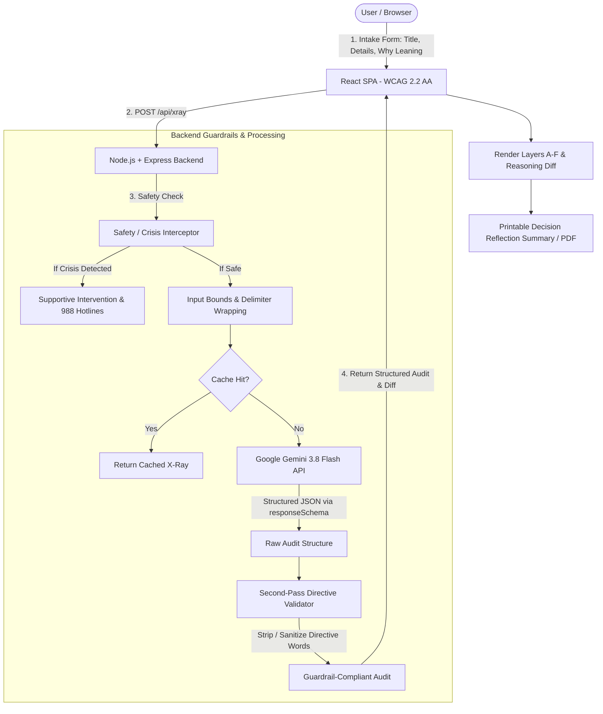

# BlindSpot: a Decision Reasoning X-Ray

> An AI-powered cognitive auditor that exposes attention gaps, unstated assumptions, and internal conflicts in your thinking—**without ever recommending, ranking, or scoring options**.

---

## 1. The Core Idea: Auditing the Thinking, Not the Options

Most decision-support tools fail because they generate generic pros/cons lists or attempt to tell users what to do. 

**BlindSpot is fundamentally different:**
1. **The user's write-up is treated as DATA, not a prompt for advice.**
2. People rarely make bad decisions because they lack facts; they make bad decisions because **the information that is most visible gets all the attention**.
3. BlindSpot maps your **cognitive airtime** against typical decision weights, exposes **hidden assumptions** with cheap 72-hour falsification tests, catches **internal contradictions** using your own words, and provides **open inquiries to sit with**.
4. **Epistemic Guarantee**: BlindSpot will NEVER say "you should", score an option, or declare a winner.

---

## 2. Architecture & Data Flow



---

## 3. Google Cloud Services Architecture & Rationale

BlindSpot integrates an enterprise-grade suite of Google services designed for security, privacy, and low-latency cognitive auditing:

| Google Service | Role & Integration | Architectural Rationale & Why It Was Chosen |
| :--- | :--- | :--- |
| **Google Gemini API (`gemini-3.8-flash`)** | Core Reasoning Audit Engine | Uses the modern `@google/genai` SDK with strict `responseMimeType: "application/json"` and declarative `responseSchema` constraints. Gemini 3.8 Flash delivers sub-second inference speeds, strict adherence to JSON schemas, and reliable instruction following to guarantee zero-directive outputs. |
| **Google Cloud Run** | Serverless Container Runtime | Hosts the containerized Node.js Express + Vite full-stack application with automatic scaling to zero when idle. Guarantees that the `GEMINI_API_KEY` remains strictly server-side, isolated from client JavaScript bundles. |
| **Google Cloud Secret Manager** | Secure Credential Storage | Stores the `GEMINI_API_KEY` encrypted at rest and in transit. Automatically mounted to Cloud Run as an environment variable, preventing API keys from ever being committed to source control or exposed in build artifacts. |
| **Google Cloud Build** | Serverless CI/CD & Image Creation | Automates multi-stage Docker container builds directly in the cloud without requiring local Docker daemon installations, compiling Vite assets and bundling Express cleanly. |
| **Google Artifact Registry** | Secure Container Registry | Stores production OCI container images with vulnerability scanning and IAM-controlled access for Cloud Run deployments. |
| **Google Cloud Logging & Monitoring** | Privacy-Safe Observability | Tracks request throughput, latency (ms), HTTP response codes, and rate-limiting metrics while strictly redacting user decision text from all server logs. |
| **Google Fonts** | Accessible Typography | Supplies *Plus Jakarta Sans* and *JetBrains Mono* for high-legibility geometric typography, tabular numerical alignment in the Attention Map, and compliance with WCAG 2.2 contrast rules at 200% zoom. |

---

## 4. Deploying to Google Cloud Run from AI Studio

Follow these steps to deploy BlindSpot directly from AI Studio to a production Google Cloud Run service:

### Step 1: Export Code from AI Studio
1. In the Google AI Studio header, click the **Export** or **Download / Git** button to sync your code to a GitHub repository or download the project archive.
2. Ensure you have the Google Cloud CLI (`gcloud`) installed locally or open Google Cloud Shell in your browser:
   ```bash
   gcloud auth login
   gcloud config set project YOUR_GCP_PROJECT_ID
   ```

### Step 2: Enable Required Google Cloud APIs
Run the following command to enable Cloud Run, Cloud Build, Secret Manager, and Artifact Registry:
```bash
gcloud services enable \
  run.googleapis.com \
  cloudbuild.googleapis.com \
  secretmanager.googleapis.com \
  artifactregistry.googleapis.com
```

### Step 3: Store Gemini API Key in Secret Manager
Store your Gemini API key securely in Google Cloud Secret Manager:
```bash
echo -n "YOUR_GEMINI_API_KEY_HERE" | gcloud secrets create gemini-api-key \
  --data-file=- \
  --replication-policy="automatic"
```

Grant Cloud Run access to read this secret:
```bash
PROJECT_NUM=$(gcloud projects describe $(gcloud config get-value project) --format='value(projectNumber)')
gcloud secrets add-iam-policy-binding gemini-api-key \
  --member="serviceAccount:${PROJECT_NUM}-compute@developer.gserviceaccount.com" \
  --role="roles/secretmanager.secretAccessor"
```

### Step 4: Build the Container with Cloud Build
Create a repository in Artifact Registry and build the multi-stage container:
```bash
# 1. Create an Artifact Registry Docker repository
gcloud artifacts repositories create blindspot-repo \
  --repository-format=docker \
  --location=us-central1 \
  --description="BlindSpot container images"

# 2. Build and push the container using Google Cloud Build
gcloud builds submit --tag us-central1-docker.pkg.dev/$(gcloud config get-value project)/blindspot-repo/blindspot-app:v1
```

### Step 5: Deploy the Service to Cloud Run
Deploy the container with the mounted Secret Manager environment variable:
```bash
gcloud run deploy blindspot \
  --image us-central1-docker.pkg.dev/$(gcloud config get-value project)/blindspot-repo/blindspot-app:v1 \
  --region us-central1 \
  --platform managed \
  --allow-unauthenticated \
  --port 3000 \
  --memory 512Mi \
  --cpu 1 \
  --min-instances 0 \
  --max-instances 10 \
  --set-secrets GEMINI_API_KEY=gemini-api-key:latest \
  --set-env-vars NODE_ENV=production
```

Once deployment completes, Cloud Run will output a public HTTPS URL (e.g., `https://blindspot-xxxxxx-uc.a.run.app`).

---

## 7. What BlindSpot Deliberately Won't Do

1. **BlindSpot will NOT recommend an option**: It will never say "You should take the startup job."
2. **BlindSpot will NOT score options**: No 8.5/10 ratings, pros/cons tallies, or decision matrices that encourage artificial certainty.
3. **BlindSpot will NOT substitute for human judgment**: The user remains 100% sovereign over their choice.
4. **BlindSpot will NOT store your decisions on remote servers**: Privacy by design; data remains in local browser session memory unless the user explicitly exports a PDF/Markdown summary.

# Yash_Promptwars
